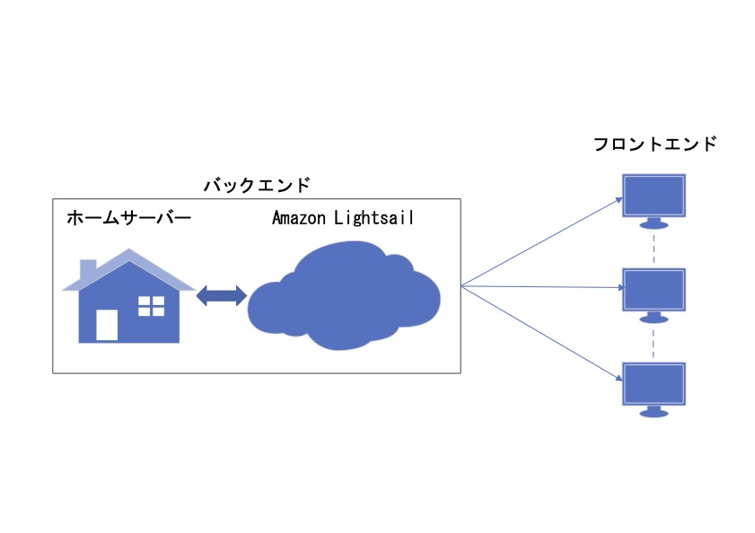
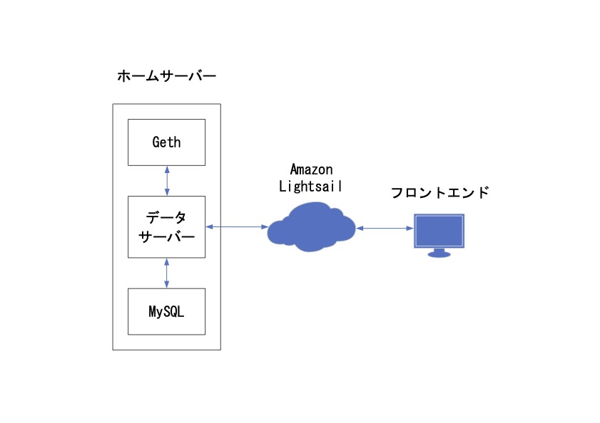
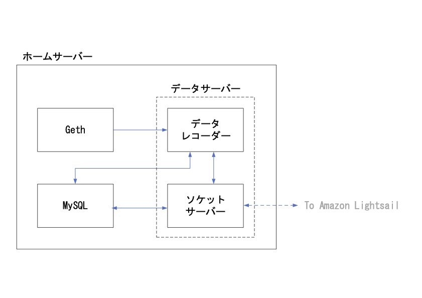
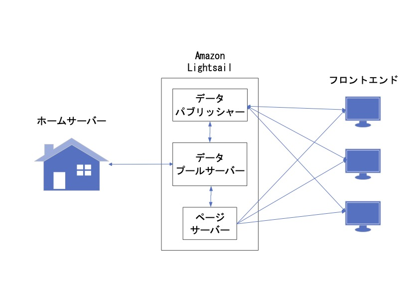
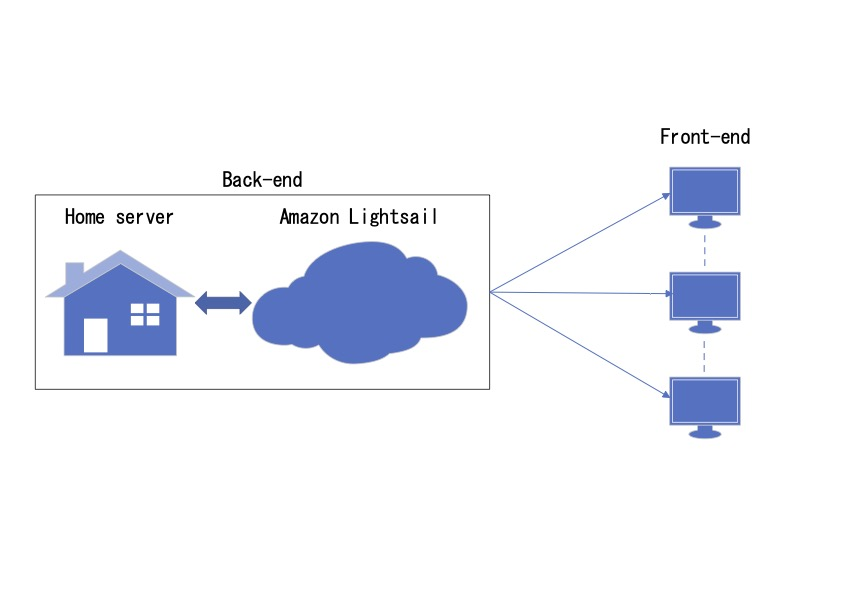
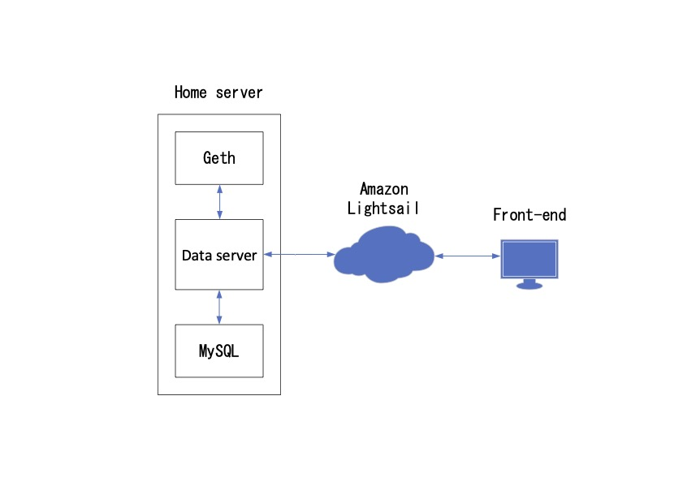
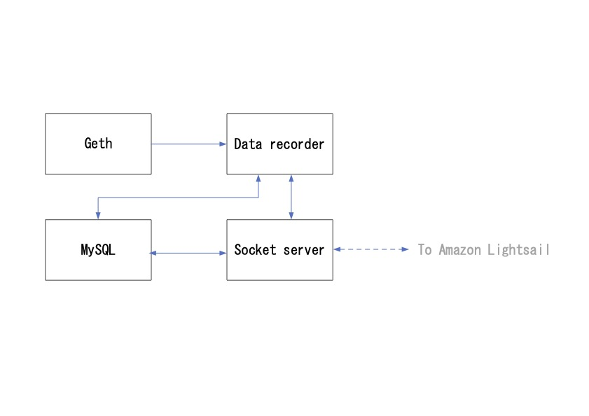
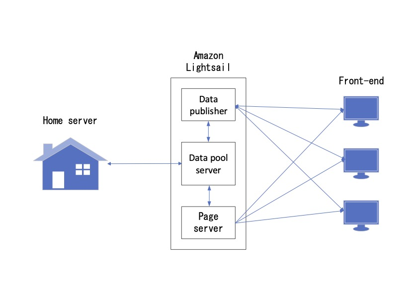

# ethereumNetStatsについて

<!-- TOC -->
* [ethereumNetStatsについて](#ethereumnetstatsについて)
* [システム概要](#システム概要)
  * [ホームサーバー](#ホームサーバー)
    * [Geth](#geth)
    * [MySQL](#mysql)
    * [データサーバー](#データサーバー)
  * [Amazon Lightsailインスタンス](#amazon-lightsailインスタンス)
    * [データプールサーバー](#データプールサーバー)
    * [データパブリッシャー](#データパブリッシャー)
    * [Reactサーバー](#reactサーバー)
* [About (English)](#about)
<!-- TOC -->
# システム概要
[ethereumNetStats](https://ethereumnetstats.info/)は、暗号資産イーサリアムのネットワークステータスを表示するウェブサイトです。  
このウェブサイトは、典型的なフロントエンドーバックエンドシステムです。  
しかし、バックエンドは単一のサーバーではなく、ホームサーバーとAmazon Lightsailインスタンスとを組み合わせた構成にしています(Fig.1)。  

Fig.1

## ホームサーバー
ホームサーバーは、[Geth](https://geth.ethereum.org/)、[MySQL](https://www.mysql.com/jp)、及びデータサーバーで構成されています(Fig.2)。  

Fig.2

### Geth
[Geth](https://geth.ethereum.org/)はイーサリアムネットワークにアクセスするためにGo言語で実装されたクライアントです。  
GethはHTTPサーバーとWebSocketサーバーの機能を有していて、これらのAPIにアクセスすることによってイーサリアムネットワークの情報を取得できます。

### MySQL
[MySQL](https://www.mysql.com/jp)はOracle社が開発しているオープンソースのリレーショナルデータベースです。  
MySQLはクライアントサーバーモデルを採用しており、Javascriptのクライアントライブラリを使ってMySQLサーバーにアクセスすることによってデータの記録・取得などの操作をします。

### データサーバー
データサーバーは、私が[Typescript](https://www.typescriptlang.org)を使用して製作したもので、その構成はデータレコーダーとソケットサーバーに分けることができます(Fig.3)。  

Fig.3

 

データレコーダーは、Gethから取得したデータの記録や集計を行うことを目的とした複数のプログラムからなります。  
データレコーダーを構成するプログラムのレポジトリと概要は以下の通りです。
- [blockDataRecorder](https://github.com/ethereumNetStats/blockDataRecorder)  
  Gethからブロックデータ（ネットワーク上の取引データ、手数料、及び採掘難易度などを示すデータ）を取得してMySQLデータベースに記録します。  
- [minutelyBasicNetStatsRecorder](https://github.com/ethereumNetStats/minutelyBasicNetStatsRecorder)  
  ブロックデータに含まれるデータから取引数や各種平均値などを１分ごとに集計してMySQLデータベースに記録し、ソケットサーバーに送信します。  
- [hourlyBasicNetStatsRecorder](https://github.com/ethereumNetStats/hourlyBasicNetStatsRecorder)  
  ブロックデータに含まれるデータから取引数や各種平均値などを１時間ごとに集計してMySQLデータベースに記録し、ソケットサーバーに送信します。  
- [dailyBasicNetStatsRecorder](https://github.com/ethereumNetStats/dailyBasicNetStatsRecorder)  
  ブロックデータに含まれるデータから取引数や各種平均値などを１日ごとに集計してMySQLデータベースに記録し、ソケットサーバーに送信します。  
- [weeklyBasicNetStatsRecorder](https://github.com/ethereumNetStats/weeklyBasicNetStatsRecorder)  
  ブロックデータに含まれるデータから取引数や各種平均値などを１週間ごとに集計してMySQLデータベースに記録し、ソケットサーバーに送信します。  

ソケットサーバーは、データレコーダーのプログラムによって集計されたデータやAmazon Lightsailインスタンスからの要求に応じて取得したデータの送信を目的としたプログラムです。  
ソケットサーバーのレポジトリと概要は以下の通りです。  
- [socketServer](https://github.com/ethereumNetStats/socketServer)  
  データレコーダーを構成するプログラムから受け取った通知やデータを必要に応じて他のプログラムに中継します。  
  データレコーダーを構成するプログラム群からデータを受け取ってデータプールサーバーに送信します。  
  また、データプールサーバーやフロントエンドからの要求に応じてMySQLデータベースから情報を取得して送信します。  

## Amazon Lightsailインスタンス
Amazon Lightsailでは、データプールサーバー、データパブリッシャー、及びReactサーバーの３つのインスタンスを運用しています(Fig.4)。  

Fig.4

### データプールサーバー  
データプールサーバーは、ホームサーバーから受け取ったデータを一時的に保存します。これにより、仮にホームサーバーとの接続が切れたとしても、
データの更新は停止しますが、内部に保存しているデータの提供は続けることができます。  
レポジトリは以下になります。
- [dataPoolServer](https://github.com/ethereumNetStats/dataPoolServer)

### データパブリッシャー  
データパブリッシャーは、データプールサーバーから受け取ったデータのフロントエンドへの配信やフロントエンドをから受け取ったユーザーの要求をデータプールサーバーに送信します。  
レポジトリは以下になります。
- [ethChartSocketServer]()

### Reactサーバー
Reactサーバーは、[React.js](https://ja.reactjs.org/)を使用して製作したwebサイト[ethereumNetStats](https://ethereumnetstats.info/)を
フロントエンドに提供するサーバーです。このサイトで表示するデータは全てデータパブリッシャーから取得します。  
このサーバーが提供するサイトでは、以下のことが行えます。
- 直近１０ブロック分のブロックデータのリストをリアルタイムで表示
- 各集計期間（１分、１時間、１日、１週間）ごとの 各種集計データのチャート表示
- 全ブロックデータを２５個づつに分割してページングしたリストの表示
- 入力・選択したブロックデータの検索・詳細表示
- 関連のtwitterアカウント[tweether](https://mobile.twitter.com/twe_ether)の最新のタイムラインの表示  

レポジトリは以下になります。
- [ethereumNetStatsServer]()

# About
<!-- TOC -->
* [About](#about)
* [Overall system structure](#overall-system-structure)
  * [Home server](#home-server)
    * [Geth](#geth-1)
    * [MySQL](#mysql-1)
    * [Data server](#data-server)
  * [Amazon Lightsail instances](#amazon-lightsail-instances)
    * [Data pool server](#data-pool-server)
    * [Data publisher](#data-publisher)
    * [React server](#react-server)
<!-- TOC -->

# Overall system structure
[ethereumNetStats](https://ethereumnetstats.info/) is a website that displays the network status of the crypto asset ethereum.  
The website is a typical front-end-back-end system.  
However, the backend is not a single server, but a combination of a home server and an Amazon Lightsail instance (Fig. 1).  

Fig.1

## Home server
The home server consists of [Geth](https://geth.ethereum.org/), [MySQL](https://www.mysql.com/) and a data server (Fig. 2).  

Fig.2

### Geth
[Geth](https://geth.ethereum.org/) is a client implemented in the Go language to access the Ethereum network.  
Geth has the functionality of an HTTP server and a WebSocket server, and by accessing these APIs information about the Ethereum network.  

### MySQL
[MySQL](https://www.mysql.com/) is an open source relational database developed by Oracle Corporation.  
MySQL uses a client-server model, whereby users access the MySQL server using Javascript client libraries to perform operations such as recording and retrieving data.  

### Data server
The data server was produced by me using [Typescript](https://www.typescriptlang.org), and its configuration can be divided into a data recorder and a socket server (Fig. 3).

Fig.3

 
The Data Recorder consists of several programs whose purpose is to record and aggregate the data acquired from Geth.  
The followings are repositories and overviews of the programs that make up the Data Recorder.  

- [blockDataRecorder](https://github.com/ethereumNetStats/blockDataRecorder)  
  Retrieves block data (data indicating transaction data on the network, fees, and mining difficulty) from Geth and records it in a MySQL database.  
- [minutelyBasicNetStatsRecorder](https://github.com/ethereumNetStats/minutelyBasicNetStatsRecorder)  
  Records the number of transactions, various averages, etc. from the data contained in the block data every minute in a MySQL database and sends it to the socket server.  
- [hourlyBasicNetStatsRecorder](https://github.com/ethereumNetStats/hourlyBasicNetStatsRecorder)  
  The number of transactions, various averages, etc. from the data contained in the block data are recorded hourly in a MySQL database and sent to the socket server.  
- [dailyBasicNetStatsRecorder](https://github.com/ethereumNetStats/dailyBasicNetStatsRecorder)  
  The number of transactions, averages, etc., from the data contained in the block data are recorded in a MySQL database on a daily basis and sent to the socket server.  
- [weeklyBasicNetStatsRecorder](https://github.com/ethereumNetStats/weeklyBasicNetStatsRecorder)  
  The number of transactions, various averages, etc., from the data contained in the block data are aggregated and recorded in a MySQL database on a weekly basis and sent to the socket server.  

## Amazon Lightsail instances
Three instances of Amazon Lightsail are running: a data pool server, a data publisher, and a React server (Fig. 4).  

Fig.4

### Data pool server
The data pool server temporarily stores data received from the home server.  
This means that even if the connection to the home server is lost, the Data updates will stop, but the internally stored data can continue to be provided.  
The repository is as follows.  
- [dataPoolServer]()

### Data publisher
The data publishers distribute data received from the data pool server to the front end and send user requests received from the front end to the data pool server.  
The repositories are as follows.  
- [ethChartSocketServer]()

### React server
The React server is a server that provides the website [ethereumNetStats](https://ethereumnetstats.info/) produced using [React.js](https://ja.reactjs.org/).
All data displayed on this site is obtained from a data publisher.  
The site provided by this server can do the following
- Display a list of the last 10 blocks data in real time.
- Display charts of various aggregate data for each aggregation period (1 minute, 1 hour, 1 day, 1 week).
- Display of a paged list of all block data divided into 25 pieces each.
- Search and detailed display of input/selected block data.
- Display of the latest timeline of related twitter accounts [tweether](https://mobile.twitter.com/twe_ether).  

The repository is as follows.
- [etheremNetStatsServer]()
